# Merges

### Fast-forward Merge

Säg att du har en main-branch och en feature-branch.

Din feature branch är branched ifrån din main branch.

Och du har bara arbetat på feature-branchen sedan dess. Main branchen är alltså i precis som state som den var i när du skapade din nya branch.

I detta fall kommer en merge att vara väldigt enkelt att slutföra.

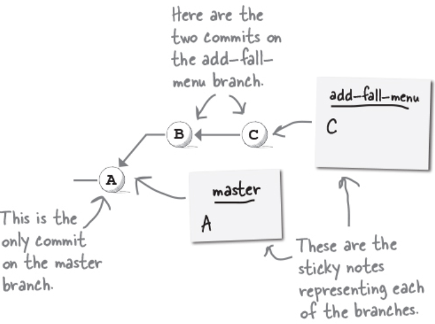

Allt Git behöver göra är att flytta din main branch till samma commit som din feature branch.

Eftersom din feature-branch innehåller redan allt som main-branchen innehåller!

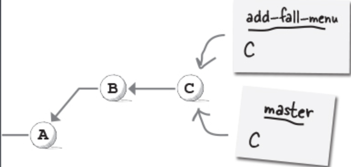

När man merge är fast-forward den bästa mergen, eftersom tekniskt sett är det inte en merge, det är bara att en branch tar sig ikapp en annan.

I fallet ovan låg båda på A.

add_fall_menu gick sedan vidare till C.

master stannade kvar på A.

När vi sedan kör git merge add_fall_menu ifrån master-branchen, så hoppar den bara till samma commit som add_fall_menu ligger på.

Den kommer ha samma commit id (sha).

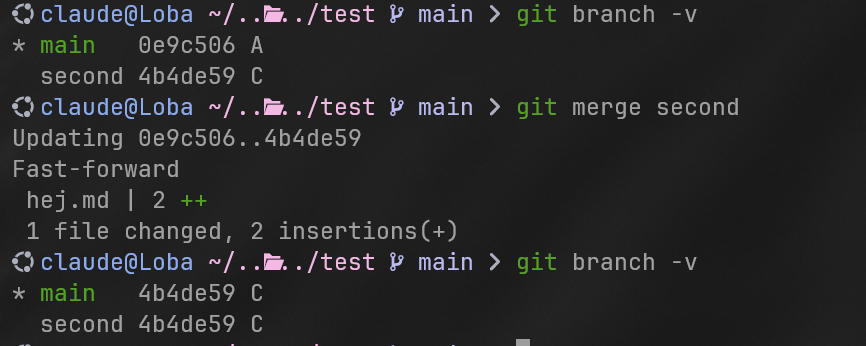

Här hade vi en second med commits A , B & C

och en main med commits A.

Efter vi fast-forward merge “second” in i main så delar dom nu samma commit id.

Hade vi i detta fall försökt merge main (proposee) med second (proposer) så hade vi fått ett meddelande som säger: “Already up to date”, för att second redan består av allt som main har med mer!

### Merge Commits (Merga “diverging branches”)

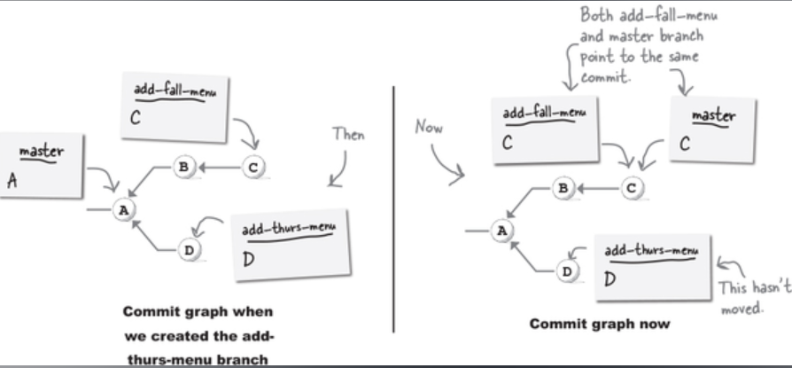

I ovanstående exempel så använder vi Fast-forward merge.

Vår merge resulterade bara i att parent-branchen kom ikapp sin child-branch.

Men vad ifall vi vill merge två brancher som har divergeat ifrån varandra?

I fall dom inte har några konflikterande filer så kommer git att öppna upp en text editor för dig att skriva in ett meddelande i


Det är bara att acceptera meddelandet, och nu har vi merge:at!

Lägg märke till att i det här fallet så har vi inte längre hamnat på samma commit id.

Utan vi har skapat en helt ny commit.

Lägg även märke till att vår mergeade branch’s commits dyker också upp. För vi har tagit båda dessa branches och all deras commit historik och sammanfogat dessa.

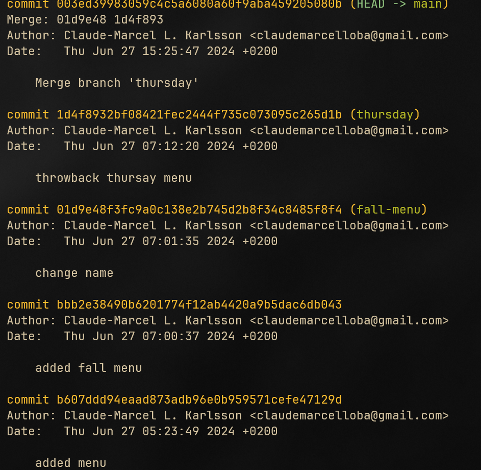

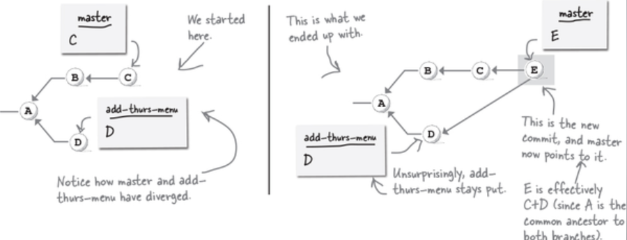

Merge Commits har två föräldrar:

Den första föräldern är den sista commiten av föräldern som är “the proposer”, och den andra föräldern är den sista commiten av vår “proposee” som vi merge:ade in.

Merge Commits effekt på Merge History.

När vi gör en merge commit så knyter vi ihop två commit punkter som har diverge:at ifrån varandra någon gång i tiden. Så två blir 1.

### Merge Conflicts

Föreställ dig ett multiverse - du existerar i båda dessa.

I ena är du en superhjälte och i den andra är du en superskurk.

Vad händer sedan när dessa multiverses kolliderar?

Det kan endast finnas en av dig. Så vilken kommer det att vara superhjälten eller superskurken?

I andra ord, vad händer om vi arbetar på samma fil i olika branches, vad händer om vi arbetar på samma rad kod, på alla dessa branches - vad händer då när vi försöker merge:a dessa?

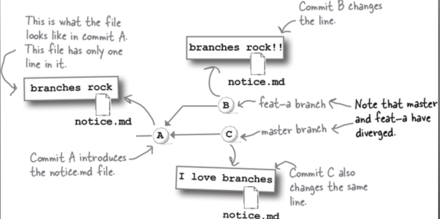

Merge conflicts sker när vi försöker ta ihop commits som påverkar samma fil på olika sätt.

När något sådant sker så har Git ingen aning om vilken version du vill ha.

Så den **stoppar** mergen och rapporterar en **merge conflict.**

Git gör sitt bästa för att försöka vägleda oss:

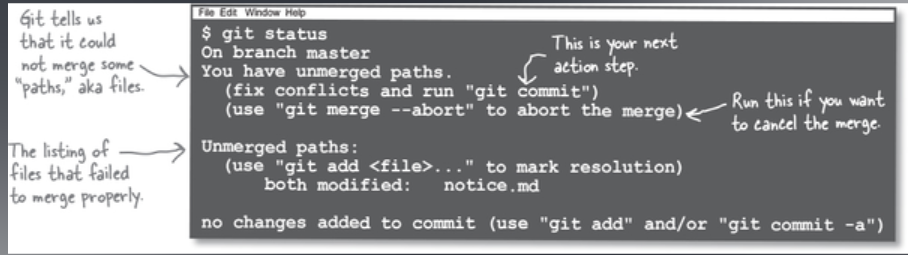

Mergen avbryts omedelbart men git säger åt oss vad för fil som har en konflikt.

**Git status** gör precis som git merge, och säger vilka filer som kolliderar, att fixa dessa filer, och att köra **git commit** igen.

Öppnar du sedan den filen är detta vad du kommer att se:

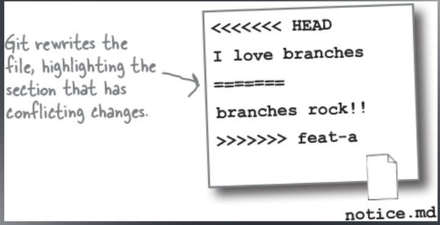

Det är inte så komplicerat som det ser ut.

Tänk på: Vi har 2 branches som vill merge till 1.

Det här är vad detta betyder:

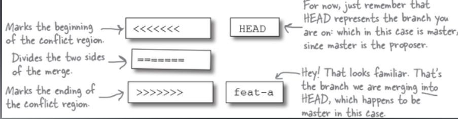

Så

```python
<<<<<<<<<<  # Detta markerar början på konflikten.

========== # Detta säger att över denna är ena branchens kod. Under detta är den andra.

>>>>>>>>>>> # Detta markerar slutet på konflikten.

HEAD <- HEAD representerar branchen du är PÅ. Det var alltså vår proposer.

feat <- feat är i det här fallet bara ett exempel. Detta kommer att vara namnet på
branchen som du försöker mergea in. Alltså vår proposee.
Det är namnet på branchen vi vill merge in i HEAD (som i det här fallet är main)
Så detta kommer vara dynamiskt. Och olika i varje fall.
```

<aside>
💡 **Violets are blue, Roses are red,
The commit you are on, is referred to as HEAD.**

</aside>

### Merge Conflicts: 4 alternativ

Okej så vi har en merge conflict, detta lämnar oss med 4 olika alternativ

1. Välja koden i main branchen (HEAD)
2. Välja koden i branchen som merge:as in. (Vår proposee).
3. Välja båda!
4. Eller ignorera båda och skriva något helt nytt allsamman.

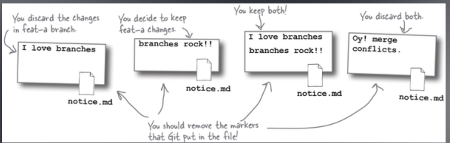

När du har valt färdigt kan du spara filen, köra git add, och sedan git commit.

Så för att klargöra, du kommer INTE se denna konflikt och Gits felmeddelande:

<<<<< HEAD ==== >>>> Second, etc. I din proposee branch. Det kommer bara existera i branchen du kör git merge ifrån.

Och när du sedan modifierat den filen:
Alltså tagit bort alla <<< HEAD === >>> Second, etc. Och lämnat kvar koden du vill använda dig utav. Så behöver du **endast:**

1. Spara filen
2. Git add filen
3. Git commit

Detta kommer slutföra commiten automatiskt, och filen kommer sparas med förändringarna du gjorde.

Det är alltså väldigt smidigt:

Får du merge conflict, ändra filen i branchen du är på, till att innehålla vad du vill, kör git add igen och sedan git commit, och detta kommer att slutföra mergen.

Du kan tillochmed ta bort filen om du så önskar.

```python
# 1. Filen ser ut såhär:
<<<<<<< HEAD
Hey
=======
Okay
>>>>>>> Proposee

# 2. Du ändrar filen genom att radera allt och lämnar kvar:
Okay

# 3. Du kör git add och git commit.

# 4. Mergen är färdig och din fil ser ut såhär:
Okay

# Tänk på att filen i din proposee branch kommer att ha kvar sin gamla kod.
# Du ändrar bara slutresultatet i din main-branch.

```
