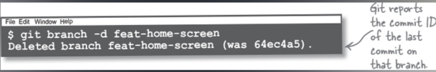
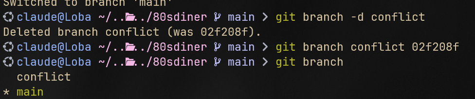

# Delete A Branch

Vi kan radera en branch med git branch -D <branch-name>

Detta kommer att ge oss ett meddelande att branchen har raderats, men även ge oss ett commit id för branchen som har raderats.

### Om vi raderar fel branch

Den här commit id:n är **bra att ha** om vi märker att vi har raderat fel branch.

Med hjälp av detta commit id så kan vi enkelt återställa en raderad branch.

Detta görs med:

**`git branch <branch-name> <base-commit-id>`**

<aside>
💡 Vi behöver INTE ha samma namn på branchen när vi återställer den. Det enda som är viktigt är vår base-commit-id.

</aside>

Raderade commits kommer att finnas kvar ifall dom behövs för din commit history.

Tänk på att en mergead branch har två föräldrar: Proposer, och proposee.

Ifall vi raderar proposee branchen efter att vi har mergeat in den så kommer den fortfarande synas i vår commit historik.

Så länge det finns en referens till en commit genom en branch eller genom att en annan commit pekar på den som en parent, så kommer denna att finnas kvar i vår commit history.

# Bullet Points

- När du arbetar i Git så arbetar du ALLTID i en branch. Varje repository börjar med en branch som ofta heter något i stil med master eller main.
- Master-branchen är inte speciell överhuvudtaget. Det är en branch som vilken annan som helst. Vi kan radera eller byta namn på denna utan någon skada skedd.
- Vi kan tänka på en branch som en sticky note som innehåller branchens namn och commit id:et av den senaste commiten på den branchen.
- En fast-forward commit är när vi merge:ar en förälder till ett barn, där barnet innehåller allt som föräldern innehåller. Vi kan se detta som att föräldern kommer ikapp barnet.
- När vi merge:ar två avgränsande branches så skapar git en merge commit. I en merge commit så har vi två föräldrar och inte en. Första föräldern är den senaste commit:en på vår integration branch, oftast main. Den andra föräldern är den senaste commit:en på vår feature branch.
- Ibland har samma rad kod modifierats olika i två olika branches. När vi försöker merge:a dessa kommer vi få en merge conflict. Där kommer file-n/rna som skiljer sig att inkludera:
  - `<<<< HEAD` : detta hänvisar till början av vår merge conflict och nedanför följer koden i vår integration branch.
  - `===` här delas det upp, allt som följer nedan är koden från vår integration branch.
  - **`>>>> <Branch-Name>`** : här slutar vår merge-conflict allt som kommer innan detta och **`===`** är koden från vår integration branch, aka. <Branch-Name>
  - För att lösa merge-konflikten så modifierar den här filen till att innehålla det vi vill att den ska innehålla, sedan kör vi bara git add och git commit, sedan är merge:n färdig.
- En branch är alltid baserad på en commit. Vill du starta en branch utifrån en commit så kan du skriva: **`git branch <branch-name> <base-commit-id>`** , med denna teknik kan vi även återställa en raderad branch.
- Vi kan radera en branch med git branch -d, ifall denna branch inte är merge:ad kommer vi att få ett varningsmeddelande om detta. Vill vi fortsätta med att radera branchen behöver vi använda git branch -D istället för -d
