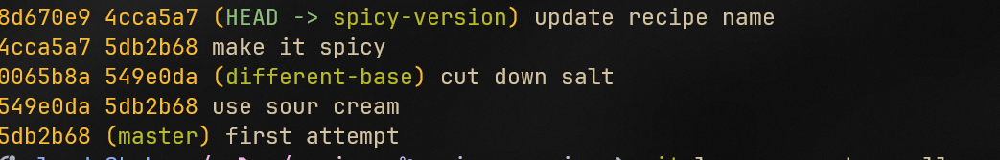
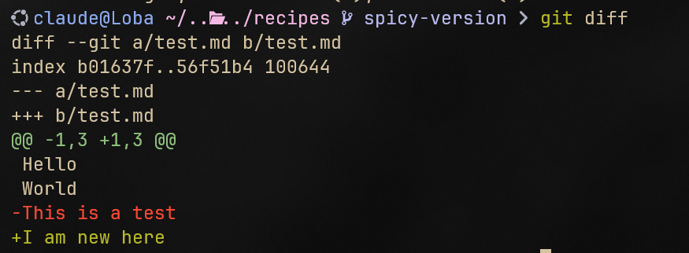
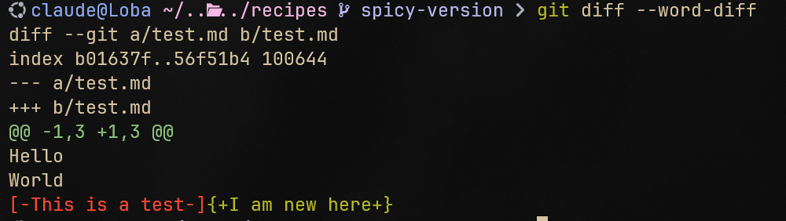

# Investigating Your Git Repository

Git Log

vi använder git log för att skriva ut vår commit history

Här kan vi använda flags såsom —graph —oneline —decorate —parents

- **`-graph`**: This flag adds a visual representation of the branch structure in the log output. It uses ASCII characters to draw a graph showing the branch and merge history.
- **`-oneline`**: This flag condenses each commit to a single line. It shows the commit hash and the commit message, making the log easier to read and scan quickly.
- **`-decorate`**: This flag adds information about branches, tags, and other references to the commit messages in the log output. It helps to see where the current commit is in relation to these references.
- **`-parents`**: This flag shows the parent commit hashes for each commit. It is useful for understanding the ancestry and merge history of the commits.
- **`—all`** : Detta får ut loggen ifrån varje branch och tags.

Här är en git log —all —parents

Här kan vi se att branch different-base och spicy-version båda började ifrån master branchens senaste commit.

Parent commit id är det andra commit id’t vi ser:

### Diff

Vi kan se ändringar i en fil genom att använda **`git diff`**

Första raden: `diff --git a/test.md b/test.md` visar oss vilken fil det rör sig om.

Det säger att den jämför a/<filnamn> med b/<filnamn>. a/ är filen i index, och b/ är filen i vårt working directory.

Detta följs utav en rad som ser ut såhär:

`index b98903f..3d77c54 100644` som kan ignoreras då det högst förmodligen inte kommer att behövas i våra dagliga git-operationer.

Följningsvis är två rader som vi kan tänka på som vår legend: git diff säger här åt oss att ifall vi ser en rad med —- så tillhör den a/, vilket är vår gamla fil.

Och ser vi +++ så till hör denna b/ vilket är vår nya fil.

Börjar inte text med varken +++ eller —- så är detta text som existerar i båda filerna, och inte har raderats i vår nya version.

I fallet ovan är _Hello World_ kvar, medan _This is a test_ är borttaget i vår nya version, men existerar i vår gamla, samt att _I am new here_ existerar i vår nya version men inte vår gamla.

### Git Diff: Hunks

`git diff` visar inte upp hela filen när vi åberopar detta, det hade varit orimligt ifall vi har en fil med flera hundra rader kod.

Istället så visar den endast upp delarna som har förändrats, vilket kallas **hunks.**

För kontext så ger den oss starting line number 1, och hur många rader som uppvisas i denna hunk, 3.

Vi får även med närliggande text för att se hur denna kod passar in i helheten.

Vi kan använda flags för att få git diff mer intuitivt.

En populär flagga är `--word-diff` detta uppvisar orden som har förändrats sida vid sida, ifall det är så att det är en rad som har förändrats.

### Working Dir vs. Index | Index vs. Last Commit

`git diff` uppvisar endast skillnaderna ifrån vad vi har staged i Index och vad vi har i vårt nuvarande working directory.

Ifall vi skulle vilja se diff mellan vår Index och vår Last Commit så behöver vi använda oss utav flaggan `git diff --cached` eller `git diff --staged` båda dessa gör precis samma sak.

### Diffing branches

vi kan även använda git diff <branchname> <branchname2> för att jämföra diffs emellan branches.

Denna kommer då att jämföra dom senaste commitsen för varje branch.

<branchname> är vår source och <branchname2> är vår target.

Vår source kommer att vara `---a` medan vår target är `---b`

### Diffing Commits

Vi kan även diffa olika commit id’s för att se skillnad mellan specifika commits.

Du kan jämföra vilka commits du vill, dessa behöver inte ens existera i samma branch.
