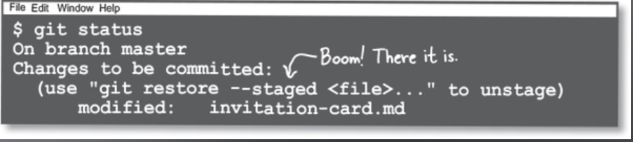

# Fixing your mistakes

## Git Restore

Säg att vi har kört git diff, som per standard jämför filer i vårt working dir med vår Index.

Och ser att vi behöver återställa vissa rader till hur dessa var i Index. Istället för att manuellt skriva om all kod så använder vi **`git restore`**

Här har vi kört `git status` och ser vi att vi har en unstaged fil, då får vi även ett meddelande kring:

`(use "git restore <file>..." to discard changes in working directory)`

`git restore` är motsatsen till `git add` istället för att ta en fil ur vårt working directory till vårt Index, så tar den här en fil ifrån vårt Index till vårt working directory.

git restore kan ta flera fil paths ifall vi vill återställa flera staged files:

`git restore <file-1> <file-2> <file-3>`

## Undo Index

I fallet ovan har vi en diff mellan filen i vårt working directory och filen i vårt Index.

Men hur gör vi ifall vi har lagt till en fil i index redan?

Vi får svaret ifall vi har staged files och kör `git status`

Allt vi behöver göra är att köra `git restore` med `--staged` flag.

Detta ersätter alltså filen i vårt Index med filen vi har i vårt commit object.

## git checkout HEAD <file>

Vad ifall vi vill återställa en fil i vårt working directory med hur filen såg ut i vårt commit object?

Vi hade kunnat köra:

`git restore --staged my_file.md`

Följt utav: `git restore my_file.md`

Ett enklare sätt hade dock varit att endast köra `git checkout HEAD my_file.md`

Detta tar filen i vårt HEAD (commiten vi är på) och byter ut filen i vårt working directory med denna.

## Delete Files from Git Repositories

Ifall du arbetar ifrån en ny commit med inga staged changes, men inser att du inte längre vill ha en fil så kan du använda `git rm <filename>` detta kommer att radera filen ifrån vårt Index och vårt working directory.

Ifall vi nu kollar på vår status så ser vi

`deleted: <filename>`

Ifall vi verkligen vill radera filen så bör vi `git commit` detta.

Ifall vi har ångrat oss så kan vi återigen köra `git restore --stage <filename>`
Tänk på:

- Vi använder endast `git rm` för att radera **_tracked files,_** om vi bara har en fil i vårt working directory så raderar vi den som vanligt.
- `git rm` raderar bara filen ur vårt Index och working directory, våra tidigare commit objects har fortfarande kvar dessa filer.

## Renaming and moving files

`git mv` används för att byta namn på, eller flytta, filer.

Det delar karaktärsdrag med `git rm` i och med att dessa endast fungerar på att flytta eller byta namn på tracked files, och ändrar dessa i både vårt Index samt working directory.

Precis som med git rm kan vi självklart flytta filer med File explorer, men det underlättar att använda git rm och git mv då vi slipper att både ändra detta i vårt working directory och stage våra förändringar.

## Ändra commit messages

Vi kan ändra commits med `--amend` flaggan.

Här kan vi byta namn, ändra filer, osv.

Ifall vi endast vill byta namn använder vi `git commit --amend`

Detta öppnar upp en text editor där vi får modifiera vårt commit message.

**_Viktigt är att vi inte har några förändringar i vårt working directory._**

Ifall vi har stage:at filer så kommer dessa att inkluderas i vår nya commit vi får utifrån

`git commit --amdend`

**_Hur git commit —amend fungerar_**

Commits är **immutable**, varje gång vi skapar en commit så är denna bevarad. Varje ändring vi gör kommer att skapa en ny commit och ersätta vår gamla commit i history.

Så när vi använder **`--amend`** så kopierar den över allt ifrån vår commit till vårt Index, och lämnar vår gamla commit så som den var, och sedan kör den git commit igen.

Git kommer att behålla vår gamla commit under ett tag, ifall vi har gjort ett misstag, tills den till slut raderar denna.

**_Vad ifall vi vill ändra i en fil som vi råkade commit?_**

Då ändrar vi filen i vårt working dir, stage:ar denna, och sedan kör `git commit --amend`

Detta kommer att skriva över vår tidigare commit.

Ifall vi inte vill ändra vårt commit message kan vi använda `git commit --amend --no-edit`

## Rename a branch

För att byta namn på en branch så använder vi endast `git branch -m`

Vi kan byta namn på branchen vi är på endast genom att skriva `git branch -m <new-name>`

Alternativt, så kan vi byta namn på en branch som vi inte är på genom:

`git branch -m <branch-name> <new-name>`
