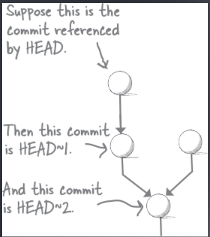
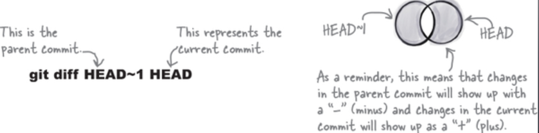
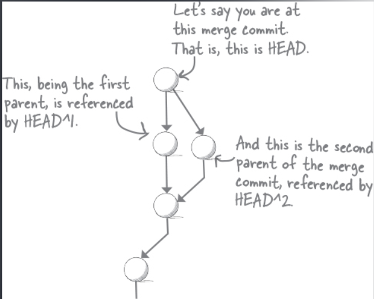
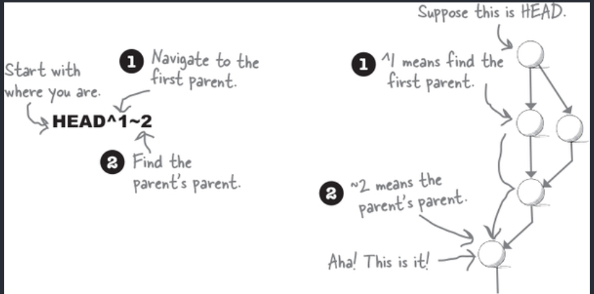

# HEAD

HEAD hänvisar till commiten vi befinner oss på.

HEAD känner till alla våra tidigare commits, därför kan vi använda HEAD för att hänvisa till andra commits i relation till vår nuvarande commit.

När vi anväder oss utav `git log` så ser vi något i stil med detta:

97a2899 (HEAD -> boardgame-night)

Här pekar HEAD på ett commit namn, vilket säger att det är där vi befinner oss för tillfället.

Och när vi listar ut branches med git branch så är \* vår HEAD.

Varje gång vi skapar en ny commit så har detta en referens till sin parent commit. Detta är HEAD som säger vilken detta är. Git tittar alltså först på vart HEAD är och pekar vår nya commit till att HEAD är dess parent commit.

HEAD är alltså en referens, liknande hur Branches är. Skillnaden är att ett repository kan ha många branches, men endast en HEAD.

Om vi ska bli tekniska, så pekar HEAD på en branch, vilket som i sin tur, som vi vet, alltid pekar på senaste commiten.

HEAD → Main → latest_commit

Det finns dock scenarion då HEAD inte pekar på senaste commiten.

Detta kallas för ett “detached HEAD” state.

## Referencing relative commits

Eftersom HEAD är en referns till commiten som vi befinner oss på, så kan vi dra nytta utav detta för att peka på commits relativa till HEAD.

Detta görs med **`~`**

Här representerar nummer **n** som följer vår ~, \*\*\*\*vår nth generational ancestor.

**`HEAD~1`** hänvisar till vår HEAD’s första parent.

**`HEAD~2`** hänvisar till vår HEAD’s grand-parent.

**`HEAD~3`** hänvisar till vår HEAD’s grand-parent parent.

och så vidare.

Detta är väldigt smidigt i vissa exempel, såsom om vi vill se en diff mellan vår nuvarande HEAD och dess parent:

`git diff HEAD~1 HEAD`

## Traversing Merge Commits

Merge Commits är som vi vet speciella. Dessa har två parents.

Hur använder vi då HEAD~n för att välja vår parent?

I dessa fall ger git oss `^`

Detta användas för att välja parent när en commit har flera parents.

**`HEAD^1`** väljer första parent.

**`HEAD^2`** väljer andra parent.

osv.

_Kom ihåg att vår första parent är commit:en som vi har mergeat in i, alltså vår base (proposer). Medan vår andra parent är vår source (proposee)._

Vi kan även kombinera ^ och ~

**`HEAD^1~2`** här följer vi parent 1’s commit history och väljer vår parents grandparents.

**`HEAD^2~1`** här följer vi parent 2’s commit history och väljer vår parents parent.

**_Så det som kommer efter ~ är alltså relativ till det som kommer efter ^_**

_Vi kan använda ~ och ^ tillsammans med commit ID’s också._
