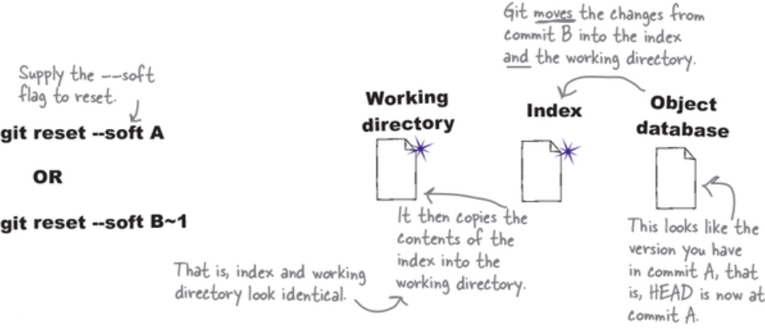
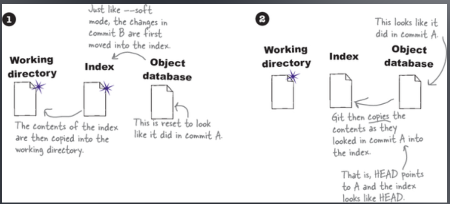
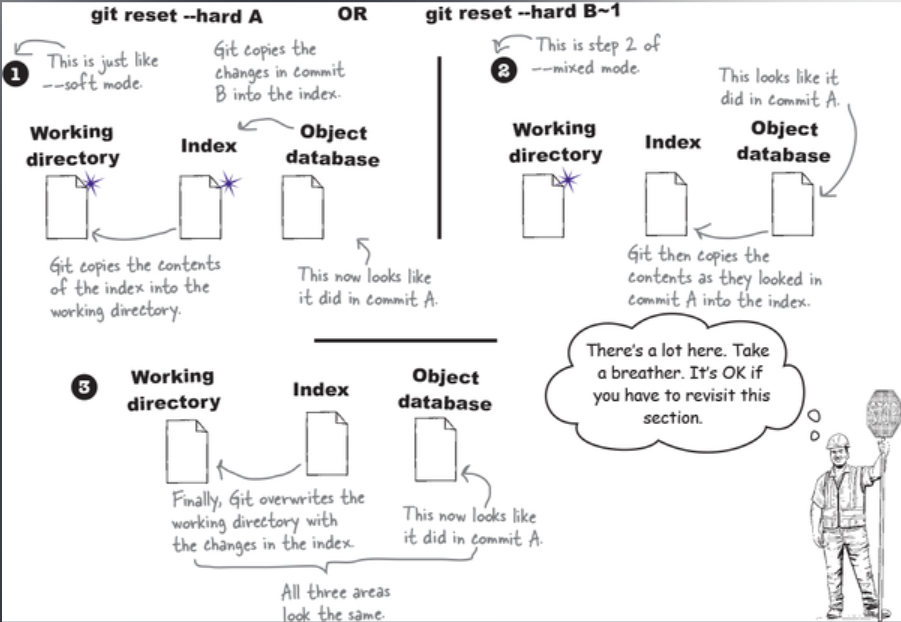

# Reset

Git har tre separata platser där filer kan leva.

Working Directory | Index | Object Database

Därför erbjuder `git reset` tre flags för att ångra en commit.

Git reset kommer oavsett alltid att flytta HEAD och vår branch till commiten vi specifierar.

Sedan får vi specifiera vad vi vill ska hända med ändringarna som tidigare var commited.

## git reset —soft

`git reset --soft` detta tar våra edits och flyttar tillbaks dessa till vår Index, och sedan kopierar den dessa filer ifrån vår Index till vårt working directory.

Dessa förändringar är alltså borttagna ur vår Object database, men existerar i både vårt working directory och vår Index, så vi är alltså endast 1 commit ifrån att åter få tillbaks dessa i vår object databse.

## git reset (git reset —mixed)

Använder vi git reset utan en flagga så använder den som standard `--mixed`

`--mixed` gör lite mer arbete än `--soft` gör.

1. Först så flyttar den filerna i vårt object database till vår Index, och härifrån så kopierar den vår Index till vårt working directory. Precis såsom `--soft` gör.
2. Sedan så kopierar den innehållet i commiten vi återsällde till, till vårt Index. Den skriver alltså över Indexen som vi kom ifrån.
   Med andra ord, med **mixed mode** så är förändringarna vi hade i commiten som vi kom ifrån nu endast i vårt working directory, och alltså inte staged i vårt Index.

## git reset —hard

git reset —hard återställer commiten vi anger och här förlorar vi alla ändringar som vi hade i commiten som vi kom ifrån.

Det är som att vår tidigare commit aldrig inträffade.

