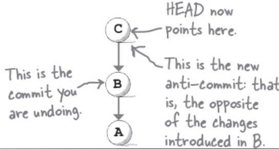

Det finns även _“anti-commits”_, i dessa fall kan vi ångra en commit.

`git revert` tar in ett commit id.

Detta skiljer sig ifrån `git reset` då vi i detta fall ger den commit id:et på commiten vi vill ångra.

Medan `git reset` tar in commit id:et på där vi vill hamna.

`git revert HEAD` kommer att ångra vår senaste commit.

Hur ser vår commit history ut efter att vi har använt `git revert`?

Jo, vad som sker är att vi får en ny commit - som är identisk med commiten som kom innan det som vi specifiera som commit id.

| git reset                                                                             | git revert                                            |
| ------------------------------------------------------------------------------------- | ----------------------------------------------------- |
| går tillbaka i tiden. Vår commit som kommer efter commit id:et vi specifiera raderas. | skapar en ny commit med samma state vi tidigare hade. |

### Bullet Points

- Git restore låter oss att ångra ändringar i enskilda filer. Som standard återställer git restore en fil i vårt working directory till hur filen ser ut i vår Index.
  Vi kan även återställa en fil i vårt Index till hur filen ser ut i vår commit med flaggan `--staged`
- Du kan radera filer som du tidigare har commited med `git rm`. Dessa raderas ifrån vårt working directory och markeras som removed i vår staging area. Ifall vi vill att dessa ska försvinna måste vi commita ändringen.
  Ifall vi vill restore dessa kan vi göra detta med `git restore`
- Du kan ändra commits med `--amend` för att behålla samma commit message använder vi `--no-edit` en amend kommer egentligen inte ändra commiten då commits är immutable. Utan vi skapar en ny commit med dom nya ändringarna, och git raderar den äldre commiten, så småningom.
- Git erbjuder två sätt att återställa commits:
  - `git reset` går tillbaka i tiden och raderar commits som kommer efter dessa.
  - `git revert` skapar en ny commit med gamla ändringar.
