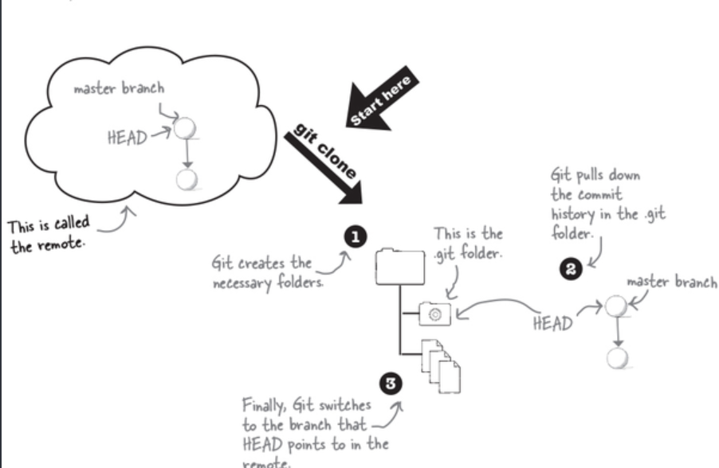
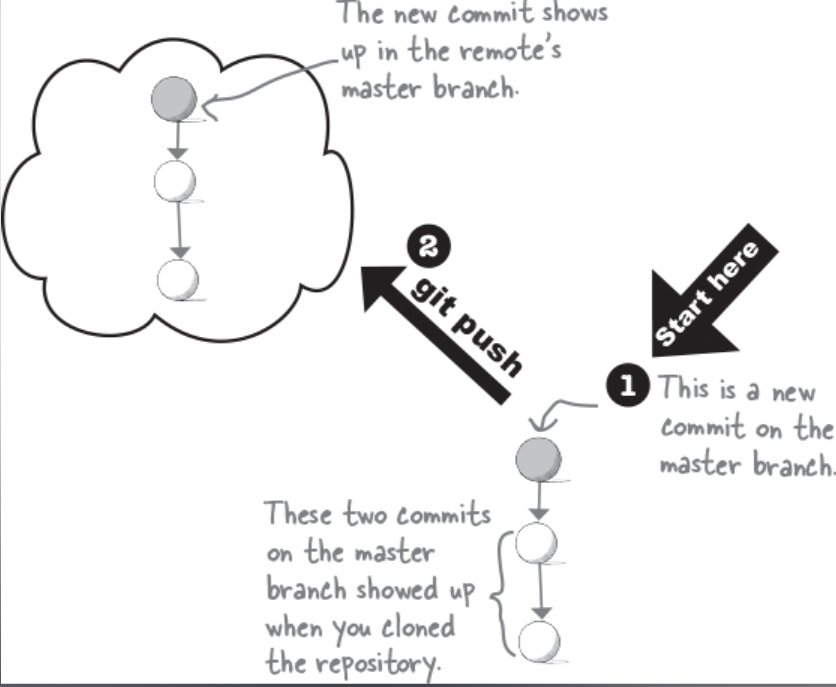
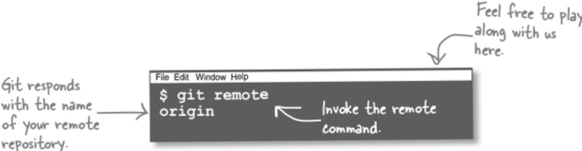
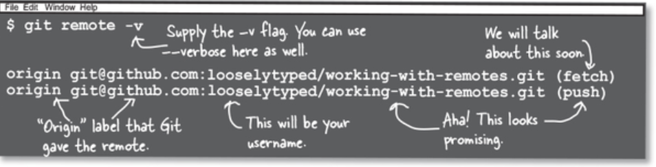
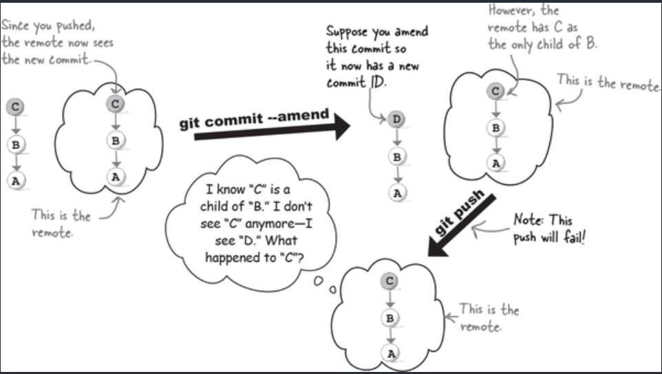
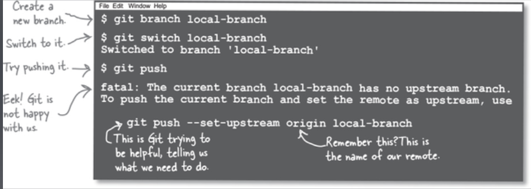
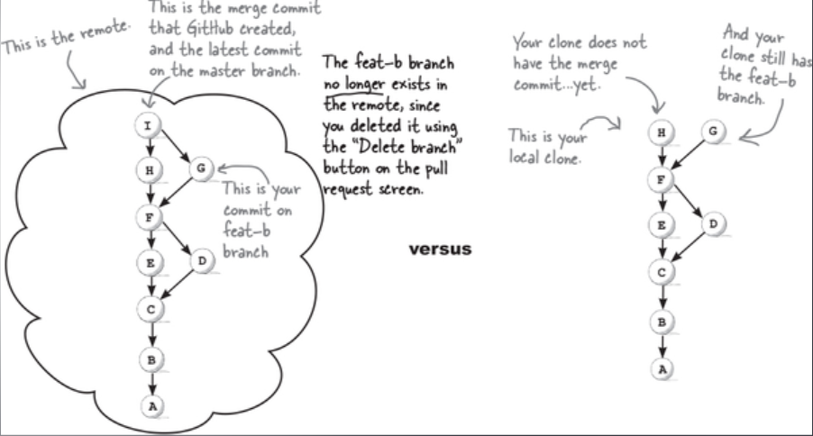

# Collaborating With Git

## Forking

Forking är en GitHub-feature som tillåter dig att kopiera ett repo till ditt konto.

Detta är alltså inte en Git-feature.

## Clone

Git clone är en git feature som tillåter dig att skapa en kopia av ett repo på din lokala maskin.

Vi kan använda `git clone` på vilket repo som helst på t.ex. GitHub, men för att få pusha ändringar till dessa så behöver vi permissions satta utav repots ägare.

Men genom att skapa en fork så kan vi ändra hur mycket som helst och pusha detta till versionen som existerar under vårt konto. Utan att behöva be en ägare om user permissions.

## Remote

Om vi klonar ett repo så är vår starting point alltid ett annat repo, detta kallas för **remote**

Vårt lokala repo är helt separerat ifrån remote repot.

Dock så vet vårt lokala repo vartifrån det har klonats.

Du kan göra hur mycket ändringar som helst till ditt lokala repo, och remote repot hade varit helt omedveten om detta.

Vi kan dra liknelser till att du skapar en meme och delar detta på sociala medier.

Personer kan ladda ner den här och ladda upp den på sina egna sociala medier, men du hade varit helt omedveten kring hur många som gjort det, men alla som har gjort det vet att memen kom ifrån dig.

När du klonar ett repo så vet inte original repot vem som har klonat det, men din klon vet vart den själv härstammar ifrån.

Vi kan dra vår liknelse vidare, ifall någon laddar ner denna meme ifrån någon som laddade ner den ifrån dig, så kommer dessa personer tro att den som dom laddade ner den ifrån är “origin” utav vår meme.

Precis så fungerar repos. Vi kan forka ett repo, och ifall någon sedan använder git clone på vårt repo, så kommer clone-versionen se vår fork som origin och behandla denna som remote.

Allt detta beror på att git är ett **distributed** version control system.

## Distributed

I ett distributed system så får alla som klonar ett repo den fullständiga versionen utav repot.

Alla branches, alla commits, alla filer, alltihopa.

Så om du har en full kopia av originalet, vad skiljer sig din version ifrån originalet? Ingenting!

Andra som har tillgång till din kopia kan nu behandla detta som originalet, eller “the source of truth”.

Fördelen med detta är att ifall något skulle hända med originalet så skulle man bara behöva byta till en annan klon och fortsätta att arbeta som vanligt.

## git push

Ifall vi `clone` ett repo, och sedan skapar en ny lägger till nya filer till Index och skapar en commit så kommer dessa ändringar endast att vara lokala.

Så för att synkronisera dessa lokala ändringar med vårt remote så måste vi använda `git push`

`git push` tillåter oss att pusha upp våra commits i vårt lokala repo till vår remote.

## Knowing where to push: remotes

Vi vet att vi kan pusha våra commits till en remote. Men hur vet Git vart den ska pusha till?

När vi klonar ett repo så vet klonen vart den härstamma ifrån, dess origin.

Vi kan fråga Git vart vår remotes location är:

`git remote` ger oss som standard, aliaset på vårt remote. Vilket av standard är “origin”.

För att få lite mer information än såhär så kan vi använda flaggan `-v` vilket står för verbose.

Här ser vi vad git har ställt in som vår (fetch) samt (push) remote.

När vi använder `git push` så använder git egentligen `git push origin` detta i sin tur pushar till commits till.

När vi skapar en commit i vår clone så är denna privat. Det är bara du som kan se denna.

Men så fort du pushar en commit så blir detta public.

När vi pushar så pushar vi vår commit historik. Så ifall vi gör något som ändrar på vår commit id på en commit som nu är public, vad händer då när vi pushar och våra ID:n inte matchar?

Såsom t.ex. `git commit --amend`

Jo, vad som sker är att Git kommer att reject din push. och förklara att dina commit-historiker inte stämmer överens med varandra.

## Pushing Local Branches

Ifall vi försöker använda `git push` på en branch som inte existerar på vår remote så kommer git inte veta vart den ska pusha till, eftersom den motsvarande branchen inte existerar på vår remote.

Ifall vi vill pusha upp en branch som vi har skapat lokalt upp till vår remote så behöver vi följa gits råd och säga namnet på branchen vi vill pusha till i vår origin.

`git push --set-upstream origin branch-name`

Vi kan även använda `-u` istället för `--set-upstream` dessa fyller samma funktionalitet.

Efter du har satt en upstream så behöver du inte sätta detta igen, för den branchen.

Vi behöver namnge `origin` för att vi har möjlighet att ha flera remotes i ett repo.

**_set-upstream?_**

Termerna _upstream_ och _downstream_ innebär helt enkelt detta:

- När vi klonar ett repo och det får data och sätter det på vår lokala maskin så är vår lokala maskin **downstream**.
- När vi pushar, eller skickar data ifrån vår clone till vår remote, så är vår remote **upstream** från oss.

## Pull Requests

En pull request är en påbörjan till en merge. Här startas code review och approvals för teamet. Och om det godkänns kan vi fortsätta till att mergea en commit historik till vår base branch.

**_Ifall någon märker ett fel i koden under en pull request, hur åtgärdar man detta?_**

Allt vi behöver göra är att öppna upp vår IDE igenom, genomföra förändringen, och sedan pusha igen. Vår Pull Request kommer automatiskt att uppdateras och uppvisa vår senaste push.

När vi har gjort en PR i GitHub så kan vi delete branchen.

Detta kommer dock endast att radera branchen på vår remote.

Vi kommer inte heller att ha merge resultatet utav vår PR på vår clone.

Så hur synkroniserar vi vår clone med ändringar som har skett i vår remote?
