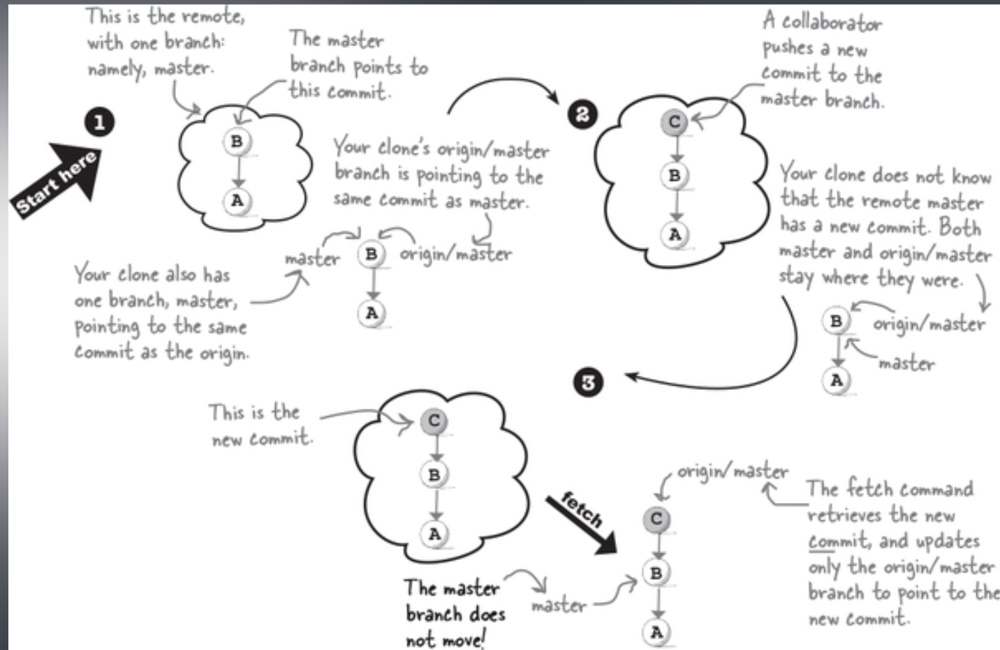

# Collaborating with Git pt 2

## Git pull

Hur får vi ikapp vår clone med en remote som har mergeat flera andra branches?

Vi använder `git pull`


_Har `git pull` något att göra med Pull Requests?_

Nej, git pull är ett git program, och pull requests är något som existerar på github.

Vissa andra git hosts kallar Pull Requests för Merge Requests, vilket kan vara mer intuitivt.

## Git config

Git erbjuder oss konfiguration när det kommer till inställningarna på git push,

`git config --global push.default simple`

Detta ställer in git push att vara i simple mode. I simple mode så är det bara branchen vi befinner oss på som pulled eller pushed när vi använder git pull / push.

## References

När vi gör push / pull så ser vi references till origin/master.

Vad är en reference?

1. Dom är git bookmarks, så att git vet vad den ska göra när du pushar till en branch.
2. Dom hjälper dig att få updates som händer i vår remote
3. Dom kan hjälpa till genom att säga åt dig att du har commits i din klon som inte existerar i din remote.
4. Dom erbjuder ett säkert sätt att “catch up” med vår remote.

## Remote tracking branches

När vi klonar ett repo så skapar git dom nödvändiga filerna, kopierar commit historiken till din .git mapp och byter sedan till default branchen.

Det gör ytterligare en sak, och det är att den skapar en kopia av alla branches som existerar i vårt remote och ger den ett prefix namn med **_origin/<branch-name>_**. Som exempel, ifall din remote hade en main-branch, så hade din clones lokala main-branch, och origin/main branch, och vår remote main branch, alla tre pekat på samma commit ID.


Dessa branches som git skapar när du gör en clone, som är prefixed med namnet av vår remote, kallas för **remote tracking branches.**

**Remote tracking branches** är annorlunda än vanliga branches.

Vi kan inte git switch / git checkout till dessa, du kan inte heller skapa, eller radera dom.

Vi har faktiskt ingen kontroll över dessa branches. Dom hanteras enbart utav git.

### Anledningar för Remote Tracking Branches

En anledning för remote tracking branches är så att git vet vad det ska göra när du gör vissa operationer såsom push & pull. Git vet vilka av dina lokala branches som är knutna till branches på remote. Vi kan se detta genom att använda `git branch -vv`
`-vv` står för **_very verbose_**

_Vad händer ifall vi skapar en ny branch i vår clone? Kommer denna ha en origin/remote?_

Svaret är nej.

Nya branches kommer inte ha en **remote tracking branch** förrän vi använder `--set-upstream`

När vi anväder `--set-upstream origin <branch-name>` så säger vi åt git att branchen den ska track i vår remote är <branch-name>


## Remote Tracking Branch after you push

När vi pushar så säger vi åt Git att synkronisera våra commits på vår lokala branch med sin motsvarighet på vår remote. Vår remote branch kommer alltså att peka på samma commit som vår local branch. Så vad händer med vår **remote tracking branch**?

När du pushar uppdateras vår remote tracking branch som finns lokalt till att spegla remote branchen. Det är viktigt att notera att remote tracking branches är lokala referenser som representerar tillståndet för remote branchen som senast hämtades eller pushades.

Om vi till exempel har en lokal branch `feature` och en remote branch `origin/feature`, kommer `origin/feature` (vår remote tracking branch) att uppdateras för att peka på samma commit som den lokala `feature`-branchen efter att vi pushat våra commits. Det är detta som gör att vi kan hålla reda på vilka ändringar som har synkroniserats med remote och vilka som inte har det.

Remote tracking branch är alltså bara ett bokmärke så att git vet vart den ska push/pull.

Detta behövs för att vi kan kalla vår remote vad som helst, den behöver inte heta just origin, vi skulle kunna döpa om denna till något annat, t.ex. upstream.

Det är inte heller tvång på att du behöver pusha din clone/master till remote/master, vi skulle kunna sätta in vår clone/master till att pusha till en helt annan branch än remote/master, t.ex. remote/feature.

Git Pull kommer att uppdatera vår remote tracking branch till att peka på vår remote branch, vilket i sin tur uppdaterar vår clone branch till att också peka på samma commit.

## Fetching Remote Tracking Branches

Så säg att vi har två kloner utav ett remote repo.

Klon 1 skapar en ny branch, och pushar dessa commits till en ny branch i vårt upstream.

Klon 2 skapar en ny branch, och pushar dessa commits till en ny branch i vårt upstream.

**_Hur ska Klon 1 få Klon 2’s nya branch till sitt lokala repo, och vice versa?_**

Svaret är `git fetch`

Git fetch’s roll är att ladda ner alla nya commits och branches ifrån vår remote, men med en tvist.

Den gör nämligen detta **_utan att påverka dina lokala branches._** Genom att uppdatera dina remote tracking branches.



Så `git fetch` hämtar dina senaste commits, men uppdaterar **endast** dina remote tracking branches, medan `git pull` uppdaterar både din remote tracking branch och din local branch.

Viktigt att notera är att `git fetch` hämtar **alla** nya commits och branches ifrån vår remote.

Hur arbetar vi på en **remote tracking branch**?

Så du har använt git fetch för att synkronisera din remote med alla dina remote tracking branches, och har nu fått massa remote tracking branches som kommer från dina collaborators pushade branches.

**Hur kan du nu arbeta på dessa?**

Kom ihåg att vi inte kan arbeta på en remote tracking branch, inte heller radera eller skapa dessa.

Jo, allt man behöver göra är att använda `git switch <branch-name>` vi skippar “origin/” delen,

Så säg att du har använt `git fetch` och nu har dina remote tracking branches synkade med remote, du använder `git branch -a` och ser alla branches såhär:

```bash
  main
  remotes/origin/HEAD -> origin/main
  remotes/origin/feat-a
  remotes/origin/main
```

allt du nu behöver göra är att använda `git switch` till branchen du vill arbeta på samtidigt som du skippar “remotes/origin/” delen av namnet.

`git switch feat-a`

Då får vi detta meddelande:

```bash
Branch 'feat-a' set up to track remote branch 'feat-a' from 'origin'.
Switched to a new branch 'feat-a'
```

När vi använder git switch till namnet på en remote tracking branch så skapar git denna branch åt oss lokalt och synkroniserar den med vår remote tracking branch.

Så sammanfattningsvis, din kollega arbetar på en branch och pushar denna.

Du behöver göra lite ändringar i den.

Så du använder `git fetch` för att få branchen tillsammans med alla dess commits som en remote tracking branch.

Du använder sedan `git switch <branchname>` och nu har du en lokal kopia av branchen, och kan göra ändringar och använda `git push` sedan kan din kollega använda `git pull` för att hämta alla dina commits.


![Notice that the fetch got you the other player’s branch, but it was a remote tracking branch (for example, in addisons-clone, there is origin/sangita-add-profile). Switching to it gives you a local branch with the same name (sangita-add-profile) as the remote tracking branch. And now it’s just another branch in your repository. You can commit on it, but that means that your local branch has now added to the commit history of that branch. In other words, your branch is now ahead of its remote tracking branch. So is there a way to know where things stand? That’s what we are going to find out next.](../img/collaborating-with-git-pt2/6.png)

Notice that the fetch got you the other player’s branch, but it was a remote tracking branch (for example, in addisons-clone, there is origin/sangita-add-profile). Switching to it gives you a local branch with the same name (sangita-add-profile) as the remote tracking branch. And now it’s just another branch in your repository. You can commit on it, but that means that your local branch has now added to the commit history of that branch. In other words, your branch is now ahead of its remote tracking branch. So is there a way to know where things stand? That’s what we are going to find out next.

## Getting Ready to Push

Vad händer ifall du använder `git fetch` och arbetar på en branch som du har fetched, men samtidigt så pushar din kollega ändringar till samma branch.

Ifall du nu inte använder `git pull` så kommer din remote tracking branch att vara en commit efter branchen på remote.

Säg att du nu skapar en ny commit lokalt.

Då kommer din branch ha divergeat ifrån remote.

Vad händer då när du använder `git push` ?


Git kan inte pusha för att den inte vet hur den ska förena dessa två branches naturligt.


Därför behöver vi köra `git fetch` igen

`git fetch` uppdaterar alla våra remote tracking branches för att se ut som vår remote.

Så nu kommer vår remote tracking branch att befinna sig på samma commit id som vår remote.


Så vad händer när vi använder `git fetch` och får vår remote tracking branch att hamna på samma commit som vår remote, och sedan kör `git status`?

Då får vi ett meddelande, antingen om att vi är bakom remote med x antal commits, och kan använda **`git pull`**. Eller ifall vi har skapat commits på vår local branch som inte finns på den uppdaterade remoten, så får vi meddelande om att dessa har divergeat och att vi behöver köra `git pull`

Ett annat sätt kan dock vara att eftersom vi vet att vår remote tracking branch (origin/<branchname>) är en branch, så kan vi mergea dessa.


## Git Fetch + Git Merge vs. Git Pull

Vad är då skillnaden mellan att utföra `git fetch` följt utav en `git merge` och en `git pull`?

Ingenting!

`git pull` leder till samma resultat som fetch + merge.

Vad händer då när vi gör en `git pull` och vi får en merge conflict?


Vi får detta meddelande,

Här kan vi ställa in hur den ska hantera merge conflicts.

Vissa föredrar dock att köra git fetch + git merge, då git pull kan kännas som lite för mycket magi och abstraktion.

Git Fetch + Git Merge vs. Git Pull?

- Git fetch påverkar inte dina lokala branches
  - git fetch har ingen påverkan på dina lokala branches, så du kan köra detta ofta, utan att det påverkar branchen du arbetar på, och sedan merge när du känner dig redo. Medan git pull påverkar både din remote tracking branch och lokala branch.
- Git fetch ger dig en chans att tänka igenom vad du gör
  - Att använda git fetch följt utav git status kan ge dig en inblick i vart din lokala branch står i kontrast till remote branchen. Vi kan även använda git diff för att se vad som har ändrats.
    Git pull ger oss inte dessa möjligheter.

Bästa sättet att testa din branch med nya pushes på master?

Det finns två sätt du kan testa nya commits på main branch med din lokala feature branch.

1. Gör en git fetch, git merge origin/main till din lokala main. Merge sedan lokala main till din lokala feature branch.
2. Gör en git fetch, git merge origin/main direkt till din lokala feature.


## Delete Branches

Efter att du har gjort en Pull Request är det vanligt att vi raderar en branch.

Detta kan vi göra genom att pusha en branch deletion:

`git push -d origin <branch-name>`

Detta kommer att radera både vår remote, och vår remote tracking branch.

Sedan får vi radera den i vår clone med det vanliga `git branch -d <branch-name>`

Men säg att vi raderar en branch genom GitHubs UI, efter att den har mergeats in i vår integration branch.

Då kvarstår fortfarande vår remote tracking branch och vår local branch på vår clone.

Det enklaste sättet här att få bort vår remote tracking branch är genom `git fetch -p`

`-p` står för **prune** och raderar alla remote tracking branches som inte har en motsvarighet i vår remote.

Så för att radera en branch på alla repos:

```bash
git push -d origin <branch-name>
git fetch -p
git branch -d <branch-name>
```

## Bulletpoints:

- Din klon är omedveten om alla ändringar som sker i remote, inklusive branches och commits som andra har pushat upp.
- `Git pull` uppdaterar en specifik branch, det hämtar alla nya commits och uppdaterar din lokala branch commit history att se ut som remotes.
- Git använder **remote tracking branches** som en “kontaktperson” mellan din remote och din clone. Det använder dessa för att veta vart den ska pusha till, och vart den ska pull ifrån.
- **Remote tracking branches** är branches, så vi kan merge:a till våra lokala branches ifrån dessa.
- **Remote tracking branches** är helt och hållet hanterade utav git. Git skapar, uppdaterar, och raderar dessa.
- `git fetch` används för att synkronisera ALLA våra remote tracking branches med våra remote branches.
- `git push` behöver att vi sätter en upstream första gången vi pushar en ny branch. Detta är vilken branch på vår remote som ska knytas till vår lokala branch, genom en remote tracking branch. Vi sätter namnet på branchen och specifierar vår remote.
  `git push -u origin <branch-name>`
- För att få en branch som bara existerar på remote, så använder vi `git fetch` för att hämta ner remote tracking branch, sedan använder vi git switch till denna branch. Därefter kommer git sätta upp en lokal branch som länkas till vår remote tracking branch som är länkad till vår remote.
- För att ta bort en branch i vår remote så pushar vi en deletion: `git push -d origin <branch-name>`
- För att ta bort en remote så använder vi `git fetch -p`, detta kommer att radera alla remote tracking branches som inte har en motsvarighet på vår remote.
- Att lista alla branches med `git branch -vv` kommer att markera alla raderade remote branches med “gone”, vilket indikerar att en branch inte längre har en remote motsvarighet.
