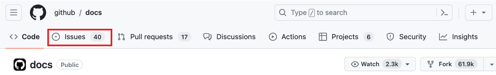
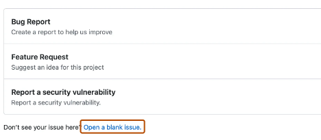

# GitHub Issues & Discussions

Det finns ett flertal sätt att skapa en issue i github.

1. Genom ett repo

Om repot har templates så kommer dessa att listas. Ifall inte karaktären utav din issue finns med, så kan du klicka på **_“Open a blank issue”:_**

Är vi admins över projektet så kan vi assigna issuet till någon, eller lägga till det i vårt **projects board**, associera det med en milestone, eller ge det en label.

Ibland kan det vara bättre att skapa en discussion:

https://docs.github.com/en/discussions/quickstart

### Discussions

Discussions är som ett forum för ditt repo. Det existerar som en flik, och tillåter konversationer mellan användare i mer naturlig form. Detta är för konversationer som behöver vara tillgängliga för allihopa och inte är relaterad till kod.

Vi aktiverar ett discussion board genom **_Settings > Features > Discussions > Set up Discussions._**

Här skriver vi en template. Vi kan även ställa in kategorier.
