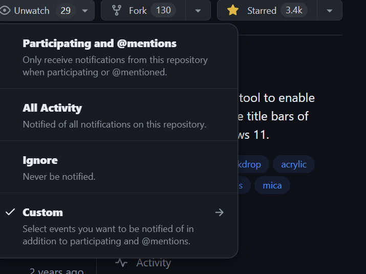

# Subscriptions and Notifications

Du kan välja att få notifikationer kring aktivitet genom att prenumerera på dessa.

Du kan ställa in prenumerationer på:

- Konversationer, pull requests, gists
- All aktivitet i ett repo
- CI aktivitet, såsom statusen av ett workflow
- Repo issues, pr’s, releases, security alerts, eller diskussioner.

Du kan ställa in en subscription under repots första sida, och trycka på watch

