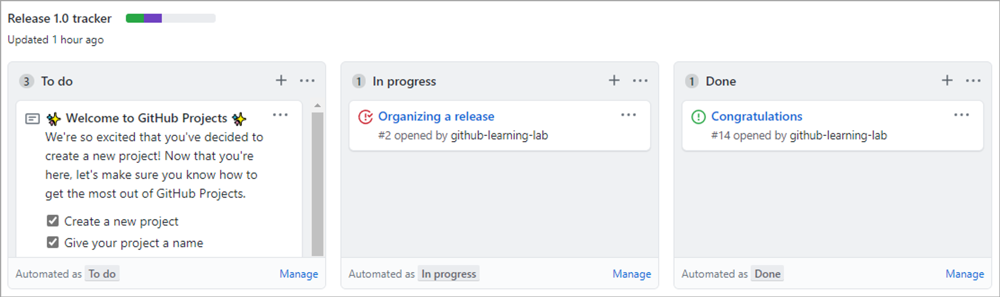
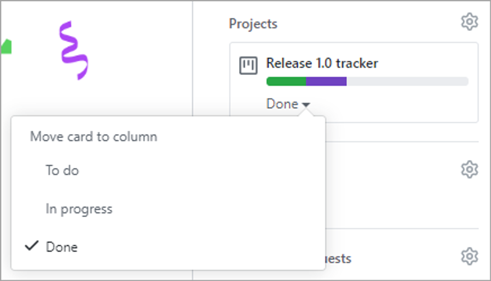
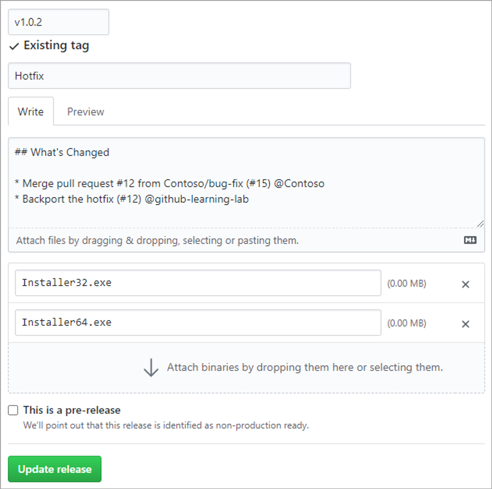
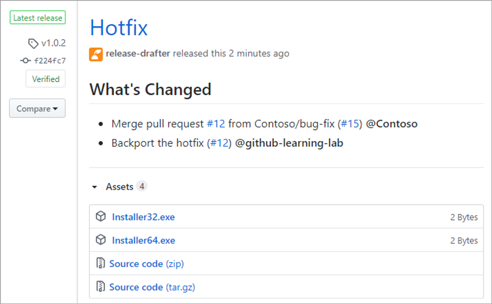

## Vad är ett Release-Based Workflow

Ett **Release-Based Workflow** är en rad mönster och policies för att **_släppa mjukvara_**.

Detta driver tre olika delar utav vår release cycle:

- Projekthantering
- Branch-strategier
- Release to customers

## Sprints

Från ett planeringsmindset så innebär att vara **_release centric_** att issues delas upp i iterationer som producerar en ny version. Dessa iterationer kallas ofta för sprints, där man ger deadlines i ungefär lika stora perioder för att producera stegvisa förändringar.

Andra team föredrar att paketera fullständiga release versioner i en enskild iteration som kan förflyta i flera månader.

I GitHub så hanteras dessa iterationer som **projects**.

## Board

Den dominanta funktionen i ett **Github project** är dess **board**.

En **board** är den centrala planen för iterationen och innehållar alla **cards** som ska slutföras.

Ett **card** kan representera en issue, en pull request, eller bara en allmän anteckning.

Som standard så börjar varje kort i **To Do**-kolumnen, och flyttas till **In progress** efter att arbetet har påbörjats, och slutar i **Done**, när arbetet är färdigt.

Vi kan finjustera dessa kolumner, lägga till automation för att se till så att cards flyttas automatiskt, eller att ändra ett cards egenskaper.

Ett Cards status integreras längs hela repot. Att dra ett Card till **Done**, kommer att ändra dess status, och uppdatera vår visuella indikator bredvid projektets titel.

Den tomma sektionen representerar kvantiten utav cards som ännu inte har påbörjats.

En **Project Board** gör det enkelt för alla stakeholders att se statusen och storleken på ett projekt, vi kan även skapa boards som är länkade till individuella användare eller en kollektion av olika repos.

## Milestones

För teams, och subsets av teams, så erbjuder GitHub **milestone** tracking.

Milestones är liknande project tracking i att det är betoning på prioriterad avklarning av issues och pull requests. Dock, medan ett project fokuserar på ett teams process, så är en milestone fokuserad på produkten.

# Välja en Branch Strategy

Repos med flera utvecklare behöver en väl-definierad branch strategy. Att bestämma sig för en enad branch strategi kommer att undvika förvirring och frustration.

## GitHub flow

En vanlig **branch-strategy** är GitHub-flow.

https://docs.github.com/en/get-started/using-github/github-flow

1. **Skapa en ny branch**
   1. Ett kort och beskrivande branch namn hjälper andra att se vad för funktion denna ska fylla vid en överblick.
2. **Gör förändringar**
   1. Ha flera commits, varje commit bör innehålla en isolerad, fullständig förändring. Detta underlättar att gå tillbaka ifall något behöver ändras. Namnbyte på en variabel och lägga till tests bör vara två olika commits.
   2. Varje commit bör ha ett beskrivande namn.
   3. Skapa en separat branch för orelaterade förändringar.
3. **Skapa en Pull Request**
   1. Om du vill ha tidig feedback eller tips innan du slutför dina förändringar kan du markera dina ändringar som “drafts”.
   2. När du skapar en PR innehåll en sammanfattning av förändringarna och vilka problem detta ska lösa.
   3. Om din PR adresserar en issue, länka issuet, så att issue stakeholders är medvetna om pull requesten, och vice versa.
4. **Adressera review comments**
   1. Reviewers kan kommentera på koden i helhet, eller kommentera på enskilda rader utav kod.
5. **Merge Pull Requesten**
6. **Radera din branch**

### Länka en issue till en Pull Request

https://docs.github.com/en/issues/tracking-your-work-with-issues/linking-a-pull-request-to-an-issue

## Working with Long-lived Branches

En **long-lived branch** är en branch som aldrig raderas. Detta är en branch strategy som används när en product har flera olika versioner som behöver supportas under för en längre period tid.

När man behöver planera för en sådan strategi bör ett repository följa standard konventionen utav:

`release-v1.0` `release-v2.0` och så vidare.

Dessa branches bör markeras som **protected** för att säkerställa att dom inte raderas eller skrivs över.

Teams bör fortfarande underhålla `main` som deras root branch och merge deras release branch upstream. När tiden är kommen bör nästa release, `release-v3.0` att baseras på main så att underhållsarbete på `release-v2.0` inte komplicerar vårt repo.

## Servicing Long-lived Branches

Föreställ dig att en bug-fix blev merge:d in i `release-v2.0` och sedan upstreamed in i `main` .

Och att det senare uppdagas att samma bug existerar i `release-v1.0`. Vad är då bästa sättet att **backport** denna fix?

Att merga `main` in i `release-v1.0` hade varit orimligt, då det hade lett till att massa commit som inte var menat för den branchen hade mergeats in också.

Att rebase hade lett till samma problem.

Ett alternativ hade varit att manuellt gjort detta, men det hade lett till för mycket rework och scaling issues.

Därför erbjuder Git en automatiserad lösning till detta: **Cherry-pick**.

### Vad är Cherry-Pick?

`git cherry-pick` tillåter utvecklare att applicera specifika commits från en branch till en annan. Det upprepar helt enkelt dom valda commitsen, och applicerar dessa på target-branchen som nya commits.

Om nödvändigt så kan utvecklare merge konflikter innan dom slutför backporten.

## Releasing to Customers

https://docs.github.com/en/repositories/releasing-projects-on-github/about-releases

När en produkt är färdig att släppas så simplifierar GitHub processen av att paketera upp det, och notifiera kunder.

Att skapa en version är så enkelt som att fylla ut formen.

- Skriv in en Git tag att applicera, detta bör följa [Semantic Versioning](https://semver.org), såsom v1.0.2, GitHub hanterar processen av att ska Git-taggen som du specifierade.
- Skriv in ett namn för din release. Några best practices är:
  - Använd ett deskriptivt namn
  - Använd release version
  - Använd en kort beskrivning av hur denna release skiljer sig ifrån den förra
  - Använd ett kodnamn eller en vanlig fras
- Bidra med release notes. Detta kan automatiseras med [Release Drafter app](https://github.com/apps/release-drafter), vilket analyserar dom förra förändringarna och inkluderar associerade PR-titlar.
- Om du vill inkludera filer såsom förbyggda installerare så kan vi drag-and-drop detta.
- Markera ifall en version är en pre-release, vilket kan låta kunder undvika pre-release versioner ifall dom önskar.

När en release är publicerad så får alla som **watch** repositoryt en notifikation.
